# 资源系统介绍

## 组成部分

1. 运行时资源管理
2. 资源打包编辑器工具
3. 版本检测及热更新


## 快速开始

如果要使用本系统，首先请**按照顺序**完成如下步骤：

1. 导入本系统package

2. 找到`EntryPrefab`目录，将预制体`ResourceManagerV2`拖入你的入口场景，通常为`main.scene`

   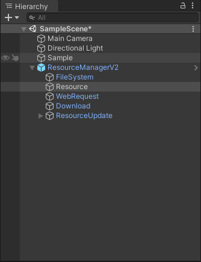

3. 在你的启动流程中添加如下代码调用`UMTResource.Initialize();`

4. 然后调用`UMTResource.HotUpdateStart();`,注意该步骤会开启热更新流程，所以请前往`ResourceManagerV2`的对象下`Resource`对象，通过Inspector修改 `Resource Mode` 为`Package`，`Resource Mode` 只对真机运行时有效

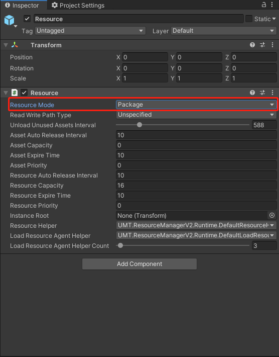

如上步骤后，你已经成功的初始化了资源系统，下面可以尝试用代码加载一个资源

​	1.菜单选择 `Editor Mode` 。即可进入编辑器模拟资源模式，该模式无需打包，API内部会直接加载原始资源。菜单模式切换（`Editor Mode`，`Package Mode`，`Updatable Mode`）只对编辑器开发中有效


​	2.调用常规加载API`UMTResource.Resource.LoadAsset`，即可加载资源，回调会在加载成功后返回你要的资源


## 资源打包


### 打包方法1 - 自动配置

1. 点击菜单 `Settings` 打开 [设置 ](Settings.md)面板

2. 配置 `PreprocessBuilds` 和 `Rules`
3. 勾选 `Auto Analysis` 点击 `Build` 按钮时会自动分析，为了兼容之前默认未开启
4. 点击 `Build` 按钮生成资源包


### 打包方法2 - 手动配置

导入包体后会看到如下菜单

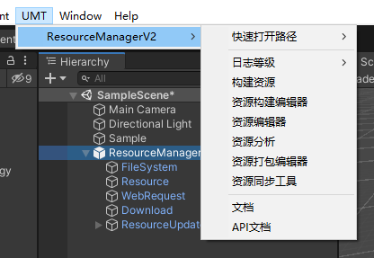

如果你要确保一个资源被打包可以通过**资源编辑器**，来将资源加入打包列表，下图时界面基本操作

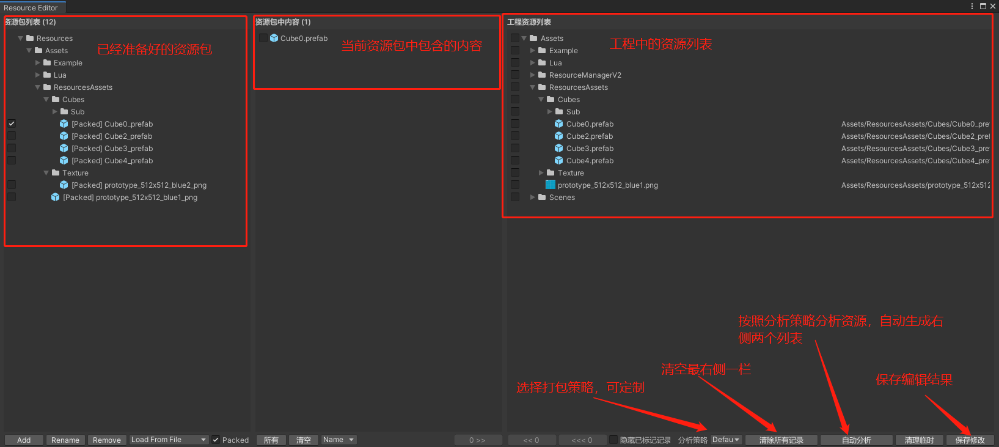

你可以通过编辑器手动编辑打包情况，也可以通过指定一个分析策略来自动分析打包。

如果采用自动，则步骤如下：

1. 点击清除所有记录
2. 点击自动分析
3. 点击保存修改

保存完毕后，**资源编辑器**界面，打开**资源构建编辑器**

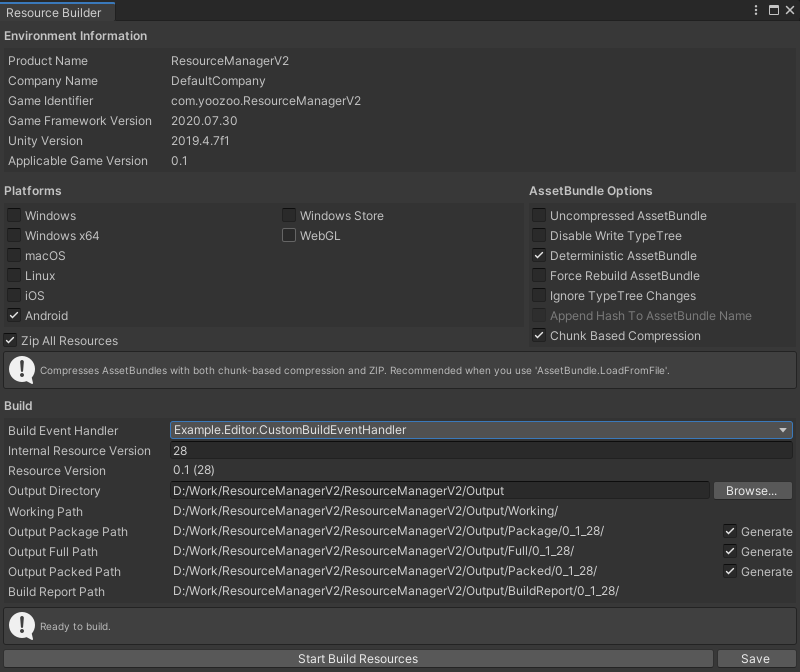

设置好路径，点击最下面的Start Build Resources打包即可，你可以将这些打包设置通过点击Save保存起来

下次可以不打开此界面，直接通过点击菜单中的**构建资源**，快速构建即可。

构建好的AB放入StreamingAssets目录下，即可

你可以通过选择菜单`Package Mode`来直接使用assetbundle打包好的资源。


## 高级资源管理

通过常规调用`UMTResource.Resource.LoadAsset`来加载一个资源，必须保证在使用后调用一次`UMTResource.Resource.UnLoadAsset`。由于内部采用引用计数，如果load两次，而只unload一次，可能会导致内存泄露。

为解决此问题，我们提供一个资源加载器ResLoader来管理

你可以通过如下代码来加载资源，一个加载器可以随意添加删除资源，使用后，只需要将该资源加载器回池即可。如果不回池，在加载器被GC回收掉之后，也会让资源引用计数减少。

示例代码如下

```C#
private ResLoader loader;

void Start()
{
    loader = ResLoader.Alloc();
}

private void OnGUI()
{
    if (GUILayout.Button("Load"))
    {
        loader.Add2Load("Assets/ResourcesAssets/Cubes/Cube1.prefab", OnLoadCube1Finish)
              .Add2Load("Assets/ResourcesAssets/Cubes/Cube2.prefab", OnLoadCube2Finish)
              .Load(OnLoadAllFinish);
        
        loader.Add2Load("Assets/ResourcesAssets/Cubes/Cube3.prefab", OnLoadCube3Finish)
              .Load(OnLoadAllFinish);
        
        loader.Add2Load("Assets/ResourcesAssets/Cubes/Cube1.prefab", OnLoadCube1Finish)
              .Load(OnLoadAllFinish);
    }
}

private void OnLoadCube1Finish(bool success,object o){
    if (success)
    {
        Debug.Log("Assets/ResourcesAssets/Cubes/Sub/Cube1.prefab loaded!!!");
        Instantiate(o as GameObject);
    }
}

private void OnLoadCube2Finish(bool success,object o){
    if (success)
    {
        Debug.Log("Assets/ResourcesAssets/Cubes/Cube2.prefab loaded!!!");
        Instantiate(o as GameObject);
    }
}

private void OnLoadCube3Finish(bool success,object o){
    if (success)
    {
        Debug.Log("Assets/ResourcesAssets/Cubes/Cube3.prefab loaded!!!");
        Instantiate(o as GameObject);
    }
}

private void OnLoadAllFinish(){
    Debug.Log("All Finish");
}

private void Destroy(){
    //回池，立即降低资源引用计数,如果该行不调用，则跟着loader的GC释放一起释放引用计数。
    loader.Recycle2Cache();
    loader = null;
}

```


## 资源自动分析策略定制

定制一个ab打包分析器非常的便捷

1. 你需要自己创建一个类实现`IAssetBundleAnalysisHandler`接口，注意要放在Editor下

```C#
public class CustomAssetBundleAnalysisHandler : IAssetBundleAnalysisHandler
    {
        public override void OnPreprocessResource(Resource resource)
        {
        }
        
        public override void OnPreprocessAnalysis(AddResourceFunction addResourceFunction,
            AssignAssetFunction assignAssetFunction,GetResourceFunction getResourceFunction,GetAssetByPathFunction getAssetByPathFunction)
        {
            
        }
        
        public override bool TryGetDistinctiveABNameFromOtherAssetPath(string assetPath, out string abName)
        {
            abName = assetPath;
            return false;
        }

        public override bool TryGetDistinctiveABNameFromRootAssetPath(string assetPath, out string abName)
        {
            abName = assetPath;
            return true;
        }
    }
```

2. 随后你就可以在资源编辑器中通过选择该策略来进行自动化分析

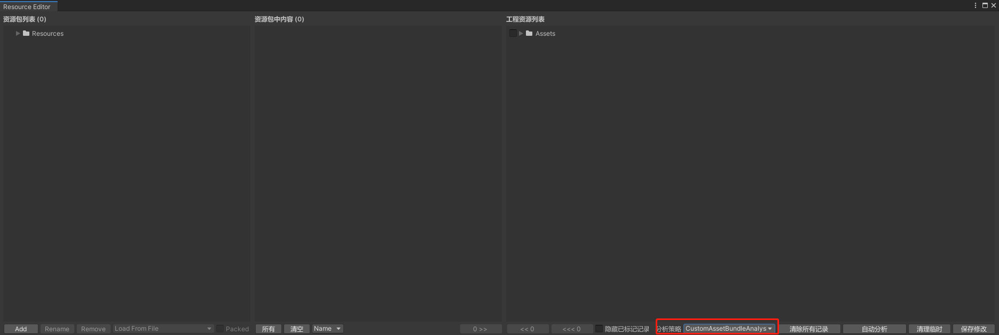


## 资源打包策略定制

1. 你需要自己创建一个类实现`IResBuildEventHandler`接口，注意要放在Editor下

```C#
public class CustomResBuildEventHandler: IResBuildEventHandler
    {
        public bool ContinueOnFailure
        {
            get
            {
                return false;
            }
        }

        public void OnPreprocessAllPlatforms(string productName, string companyName, string gameIdentifier,
            string gameFrameworkVersion, string unityVersion, string applicableGameVersion, int internalResourceVersion, BuildAssetBundleOptions buildOptions, bool zip,
            string outputDirectory, string workingPath, bool outputPackageSelected, string outputPackagePath, bool outputFullSelected, string outputFullPath, bool outputPackedSelected, string outputPackedPath, string buildReportPath)
        {

        }

        public void OnPostprocessAllPlatforms(string productName, string companyName, string gameIdentifier,
            string gameFrameworkVersion, string unityVersion, string applicableGameVersion, int internalResourceVersion, BuildAssetBundleOptions buildOptions, bool zip,
            string outputDirectory, string workingPath, bool outputPackageSelected, string outputPackagePath, bool outputFullSelected, string outputFullPath, bool outputPackedSelected, string outputPackedPath, string buildReportPath)
        {
        }

        public void OnPreprocessPlatform(Platform platform, string workingPath, bool outputPackageSelected, string outputPackagePath, bool outputFullSelected, string outputFullPath, bool outputPackedSelected, string outputPackedPath)
        {
        }

        public void OnBuildAssetBundlesComplete(Platform platform, string workingPath, bool outputPackageSelected, string outputPackagePath, bool outputFullSelected, string outputFullPath, bool outputPackedSelected, string outputPackedPath, AssetBundleManifest assetBundleManifest)
        {
        }

        public void OnOutputUpdatableVersionListData(Platform platform, string versionListPath, int versionListLength, int versionListHashCode, int versionListZipLength, int versionListZipHashCode)
        {
        }

        public void OnPostprocessPlatform(Platform platform, string workingPath, bool outputPackageSelected, string outputPackagePath, bool outputFullSelected, string outputFullPath, bool outputPackedSelected, string outputPackedPath, bool isSuccess)
        {
            
            
        }
    }
```

2. 通过资源构建管理器中的BuildEventHandler来打包

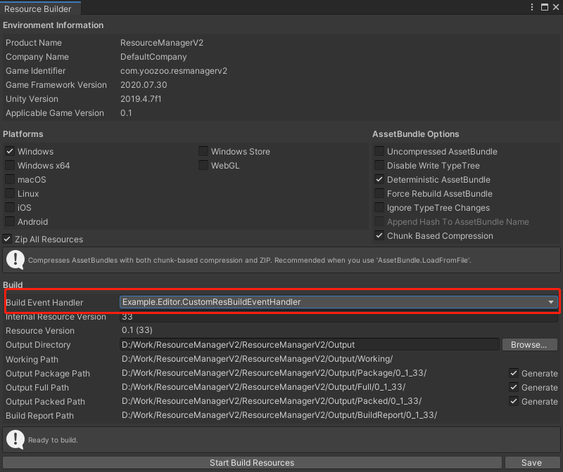


## 热更新流程定制

1. 实现一个类，继承自` UpdateStepAgentHelperBase`,这个类实现一个步骤内的操作。
2. 然后再ResourceUpdate节点下创建一个空对象，挂载你需要的步骤的脚本。
3. 通过每个步骤之间的组合来完成热更新流程。

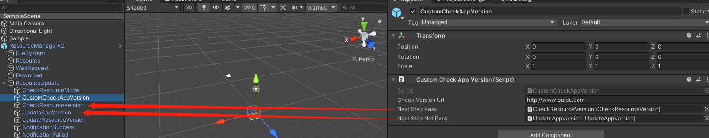

如图上所示，检查APP版本，如果通过，则开始检查资源版本号，否则直接跳转至更新APP版本。


## 关于路径

核心的配置等路径都提供了attribute，你可以通过再Editor下建立一个静态类，然后建立几个字符串，用相应的attribute标记即可

```C#
public static class CustomConfigPaths
    {
        [ResourceBuilderConfigPath]
        public static string ResourceBuilderConfigPath = Utility.Path.GetRegularPath(Path.Combine(Application.dataPath, "Example/ResourceCustomConfigs/ResourceBuilder.xml"));
        
        [ResourceCollectionConfigPath]
        public static string ResourceCollectionConfigPath =  Utility.Path.GetRegularPath(Path.Combine(Application.dataPath, "Example/ResourceCustomConfigs/ResourceCollection.xml"));
        
        [ResourceEditorConfigPath]
        public static string ResourceEditorConfigPath =  Utility.Path.GetRegularPath(Path.Combine(Application.dataPath, "Example/ResourceCustomConfigs/ResourceEditor.xml"));
        
        [AssetBundleAnalysisRootPath]
        public static string AssetBundleAnalysisRootPath =  "Assets/ResourcesAssets/";
    
        [AssetVariantPath]
        public static string AssetVariantPath =  "Assets/Variant/";

    }
```

其中这些路径含义是

| 路径含义           | attribute标签                  | 介绍                                                         |
| ------------------ | ------------------------------ | ------------------------------------------------------------ |
| 资源构建配置路径   | [ResourceBuilderConfigPath]    | 资源打包配置记录，保存后可以快速点击开始打包                 |
| 资源打包记录路径   | [ResourceCollectionConfigPath] | 资源打包分析的结果，打包时根据此文件来确定哪些资源要被打入哪些ab |
| 资源编辑器配置路径 | [ResourceEditorConfigPath]     | 资源编辑器的记录文件，如处理哪些类型资源等                   |
| 自动分析根路径     | [AssetBundleAnalysisRootPath]  | 该路径下所有资源会被认为是被代码引用加载使用，其自身及其依赖资源会被自动分析打包方案 |
| 变体根路径         | [AssetVariantPath]             | 该路径下和Assets级别相同路径和名称的资源被视作原资源的变体资源 |


## 关于图集

可以使用spriteAtlas图集功能，如果要使用图集功能，请制定好图集的根目录，然后拖拽目录到ResourceComponent上提示的区域中即可（拖拽至下图红框区域）。打包后运行时会自动使用图集。注意Editor模拟模式下将使用原始碎图。

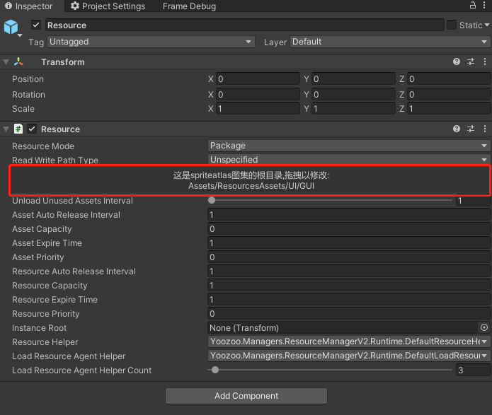


## 关于变体

变体主要用于多语言制作，资源系统在热更新时会只下载你需要的变体涉及的资源

```C#
UMTResource.Initialize();
       
//注意，请一定要在上面和下面这两个函数调用之间加入变体设置
UMTResource.currentVariant = "en";
        
UMTResource.HotUpdateStart();
```

创建一个资源的变体只需要在AssetVariantPath目录下创建变体类型文件夹，然后按照原始资源路径创建同样的路径，同名资源即可。

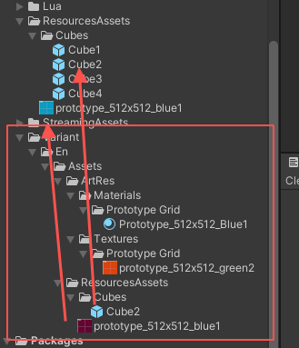

如图，当游戏使用en变体时，所有的prototype_512*512_blue1这张贴图，在游戏中都会从原来的蓝色变为变体中的紫红色。

## 如何查看当前资源情况

可以再运行时通过查看ResourceComponent的下面两个列表，

第一个列表为当前已加载使用的ab资源包情况， 左侧为ab名，右侧为当前该ab的引用计数。

第二个列表为当前已从ab中加载使用的asset情况， 左侧为asset的Path名，右侧为当前该asset的引用计数。

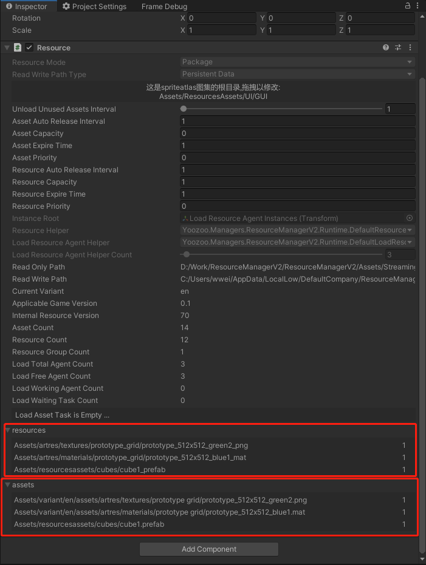


## [设备同步](DeviceSync.md)

直接同步最新的资源包到`Android`设备或模拟器上，加快开发测试

