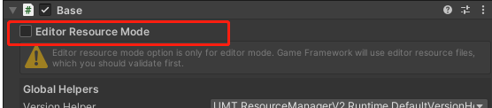
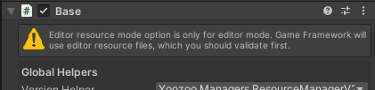

# v0.5.5 变化


## 菜单变化


- Build
  生成资源包，对应之前的 `Start Build Resources` 和 `构建资源` 菜单

- Analysis
  资源分析，对应之前的 `自动分析` 和 `资源编辑器立即生成` 菜单

- Settings
  
  打开[设置](Settings.md)界面

- Editor Mode

  改为菜单切换到编辑器模式

  之前的

  

  =》选项设置改为菜单切换或设置界面切换

  

- Document

  打开 `README.md`


## 新增 [设置](Settings.md) 界面

点击菜单 `Settings` 打开


- Set AssetBundleName

  对应之前 `Resource Sync Tools/Sync to Project`


## 使用 `Auto Analysis` 选项

JekinsBuildSupport.BuildResourcesAuto

代码

```c#
BuildResources.RunAnalysisByLatestConfig();
AssetDatabase.Refresh();
```

替换为

```c#
if (!EditorResourceSettings.AnalysisOnBuild)
{
    BuildResources.RunAnalysisByLatestConfig();
    AssetDatabase.Refresh();
}
```

勾选 `Auto Analysis` 时 BuildResources.Run  会自动执行分析


## Lua 配置

可选，可以继续使用原来的Lua生成

### 使用新的Lua生成

1.  `CustomAssetBundleAnalysisHandler`  删除 Lua 生成相关代码
2.  配置界面 PreprocessBuilds 和 Rules 添加 Lua 配置，配置值可以参考该界面


## Atlas配置

可选，可以继续使用原来的图集生成

### 使用新的图集生成

1. 修改 `CustomAssetBundleAnalysisHandler`  删除 Atlas 生成相关代码
2.  配置界面 PreprocessBuilds 和 Rules 添加 Atlas 配置，配置值可以参考该界面


`Lua`和`Atlas`如果都使用新配置，可以使用 `DefaultAssetBundleAnalysisHandler`

1. 菜单选择 `资源编辑器`
2. 分析策略选择 `DefaultAssetBundleAnalysisHandler`
3. 点击 `保存修改` 按钮


## 使用 `Copy To StreamingAssets` 选项

### CustomResBuildEventHandler

1. OnPreprocessAllPlatforms 方法，删除  StreamingAssetBuild.ClearStreamingAssets();
2. OnPostprocessPlatform 方法，删除复制到 `StreamingAssets` 相关代码

### StreamingAssetBuild

1.  StreamingAssetBuild class 下的 ClearStreamingAssets，CopyToTargetPath，CopyToStreamingAsset 方法
2. 替换为BuildResources的实现， BuildResources.ClearStreamingAssets，BuildResources.CopyToStreamingAsset，优化了性能


## 资源编辑器

- 增加 `自动保存` 勾选框，默认未开启，`清理所有记录` 和 `自动分析` 自动保存


## 资源构建编辑器

- `Platforms` 增加 `Follow project` 选项，资源包跟随平台，一般开启该选项即可


