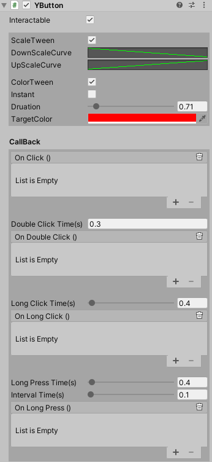

# Button

按钮组件是一个可交互的组件主要扩展了双击长按等操作，显示上增加缩放曲线和颜色变化

# 属性

|属性|功能|
|---|---|
|ScaleTween|是否应用缩放效果|
|DownScaleCurve|按下动画曲线|
|UpScaleCurve|放开动画曲线|
|ColorTween|是否应用变色效果|
|Instant|是否直接变色|
|Duration|变色动画持续时间|
|TargetColor|目标颜色|
|Double Click Time(s)|响应双击事件的灵敏度|
|Long Click Time(s)|响应长按再松手事件的灵敏度|
|Long Press Time(s)|响应长按事件的灵敏度|
|Interval Time(s)|响应长按按住事件的回调频率的时间间隔|

 

# 事件

|属性|功能|
|---|---|
|OnClick|用户单击按钮再松开时 Unity 调用的 [YEvent](event2.md).|
|OnDoubleClick|用户双击按钮松开时 Unity 调用的 [YEvent](event2.md).|
|OnLongClick|用户长按按钮再松开时 Unity 调用的 [YEvent](event2.md).|
|OnLongPress|用户长按按住按钮时 Unity 调用的 [YEvent](event2.md).|