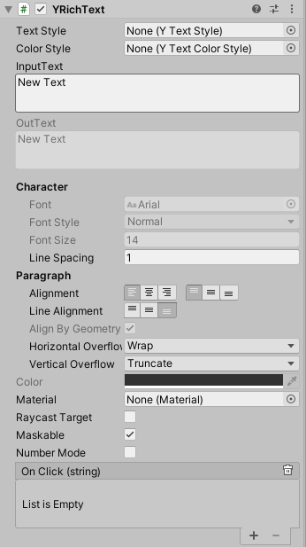

# Rich Text

一个支持点击和图文混排的富文本组件

# 属性

|属性|功能|
|---|---|
|TextStyle|文本样式|
|ColorStyle|文本颜色|
|Line Alignment|图文混排 单行行内对齐方式|
|Number Mode|用来专门显示可以跳动的数字|
|Format|在Number Mode开启的状况下设置文本格式 保留小数位数或组合方式 例如: 经验{0:#} |

 

# 事件

|属性|功能|
|---|---|
|OnClick| 有可交互标签时调用的 [YEvent](event2.md)。该事件可将当前被点击标签作为 string 类型动态参数发送.|

 

# 支持的标签

以下列表描述了 RichText 支持的所有样式标签。

|标签|描述|示例|注意事项|
|---|---|---|---|
|b|以粗体显示文本。|	`We are <b>not</b> amused.`	||
|i|以斜体显示文本。|	`We are <i>usually</i> not amused.`	||
|size|根据参数值设置文本的大小（以像素为单位）。	|`We are <size=50>largely</size> unaffected.`	|尽管此标签可用于 Debug.Log，但如果大小设置得太大，您会发现窗口栏和控制台中的行间距看起来很奇怪。
|color|根据参数值设置文本的颜色。可使用传统的 HTML 格式指定颜色。#rrggbbaa …其中的字母对应于十六进制数字对，表示颜色的红、绿、蓝和 Alpha（透明度）值。例如，完全不透明的青色将指定为 color=#00ffffff…可通过大写或小写形式指定十六进制值；#FF0000 等效于 #ff0000。|`We are <color=#ff0000ff>colorfully</color> amused	`|另一种选择是使用颜色的名称。这种方法更容易理解，但当然，颜色范围受限，并始终假设颜色完全不透明。<color=cyan>some text</color> UnityText列出了可用的颜色名称。|
|material|这仅对文本网格有用，使用参数指定的材质渲染文本部分。值为 Inspector 显示的文本网格材质数组的索引。|	`We are <material=2>texturally</material> amused`	||
|quad|这仅对文本网格有用，渲染与文本内联的图像。采用指定图像材质的参数、图像高度参数（以像素为单位）以及另外四个表示待显示图像的矩形区域的参数。与其他标签不同，quad 不会包裹一段文本，因此没有结束标签；斜杠字符放在初始标签的末尾，表示“自动关闭”。| `<quad material=1 size=20 x=0.1 y=0.1 width=0.5 height=0.5>` | 这将选择渲染器材质数组中位置的材质，并将图像的高度设置为 20 像素。图像|的矩形区域由 x、y、宽度和高度值决定，这些值全部表示为纹理的未缩放宽度和高度的一定比例。|
|p|加载一个prefab|`<p=xxx w=100 h=100 s=1 />`| 分别对应prefab路径(Assets目录下面的路径，路径不包含"Assets"和“.prefab”,如“<p=ResourcesAssets/Emoji/smail w=100 h=100 s=1/>”) 宽度 高度 缩放|
|href|描述一个点击区域被点击之后发送带标记信息的点击事件|`<href=tag0>Click</href>`|注意文本框尺寸，注意勾选RaycastTarget|