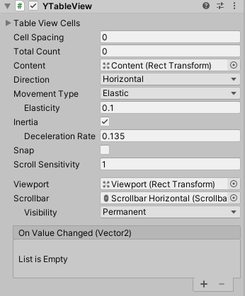

# Table View

# 属性

|属性|功能|
|---|---|
|TableViewCells| 可以选择多个 [TableViewCell](table_view_cell.md)类型组件的对象。|
|Cell Spacing|布局元素之间的间距。|
|Total Count|内容数量。|
|Direction|滚动方向。|
|Snap|停止滚动时是否对齐到内容。|

 

# 事件

|属性|功能|
|---|---|
|On Value Changed|滚动矩形的滚动位置发生变化时调用的 [YEvent](event2.md)。该事件可将当前滚动位置作为 Vector2 类型动态参数发送。|