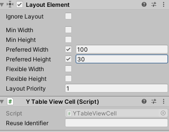

# Table View Cell

# 属性

|属性|功能|
|---|---|
|Reuse Identifier|可复用编号,不填写的话默认取name|

 

# 依赖
该组件依赖一个Layout Element组件 请正确设置 Preferred 尺寸

|属性|功能|
|---|---|
|Preferred Width |	在分配额外可用宽度之前，此布局元素应具有的偏好宽度。|
|Preferred Height|	在分配额外可用高度之前，此布局元素应具有的偏好高度。|