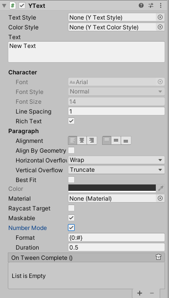

# Text

禁用了自由的字体设置和颜色设置 改成由 [TextStyle](text_style.md) 来预定义

# 属性

|属性|功能|
|---|---|
|TextStyle|文本样式|
|ColorStyle|文本颜色|
|Number Mode|用来专门显示可以跳动的数字|
|Format|在Number Mode开启的状况下设置文本格式 保留小数位数或组合方式 例如: 经验{0:#} |