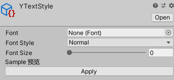
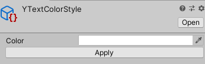
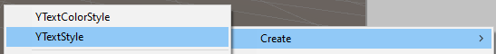

# Text Style

文本样式是用来统一文本显示的对象 总共包含两种资源分别对应 字体设置 和 颜色设置

 

# 字体设置

|属性|功能|
|---|---|
|Font|用于显示文本的字体。|
|FontStyle|应用于文本的样式。选项包括 Normal、Bold、Italic 和 Bold And Italic。|
|Font Size|显示的文本的大小。|

 

# 颜色设置

|属性|功能|
|---|---|
|Color|用于渲染文本的颜色。|

 

# 创建

通过Assets/Create/YTextStyle 和  Assets/Create/YTextColorStyle 创建

