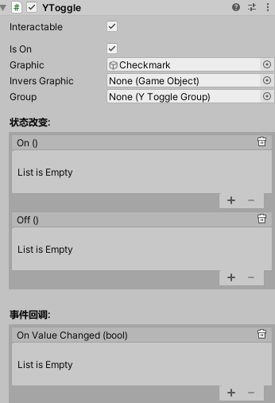

# Toggle

在UGUI的基础上增加了更加方便的显示控制

# 属性

|属性|功能|
|---|---|
|Graphic| 用于复选标记的对象，选中时Active为True **类型改成了GameObject**|
|Invers Graphic| 用于复选标记的对象，选中时Active为false **类型为GameObject**|

 

# 事件

|属性|功能|
|---|---|
|On| 开关开时调用的 [YEvent](event2.md),主要用于美术制作特殊显示状态.|
|Off|开关关时调用的 [YEvent](event2.md),主要用于美术制作特殊显示状态.|
|On Value Changed| 单击开关时调用的 [YEvent](event2.md)。该事件可将当前状态作为 bool 类型动态参数发送.|